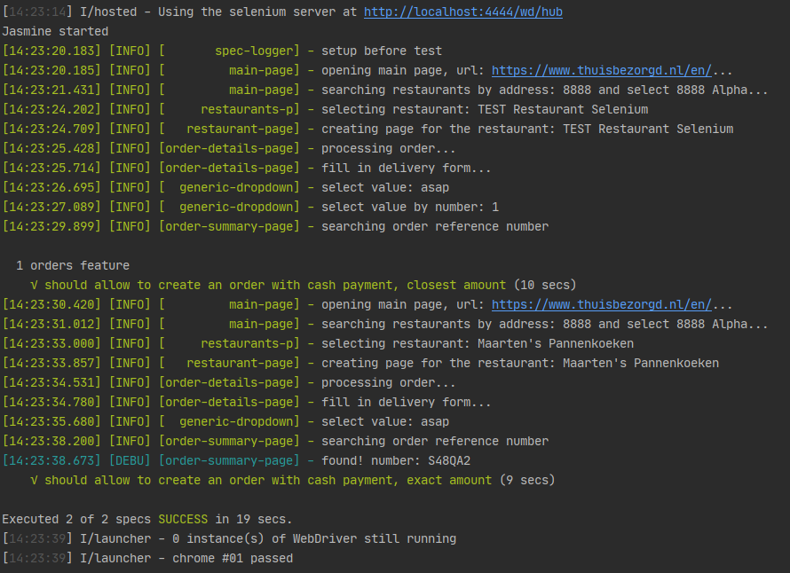
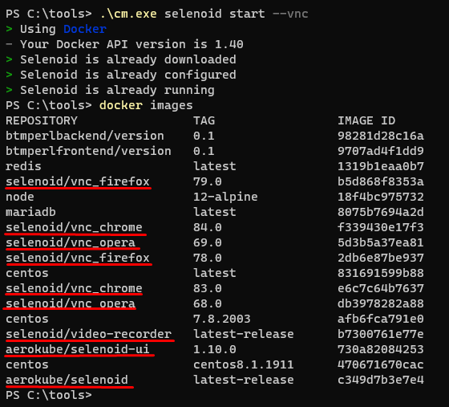
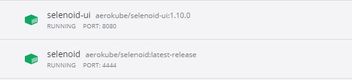
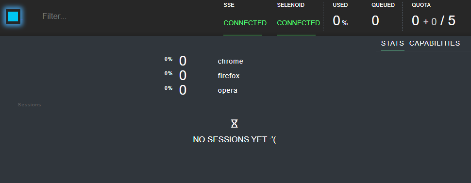
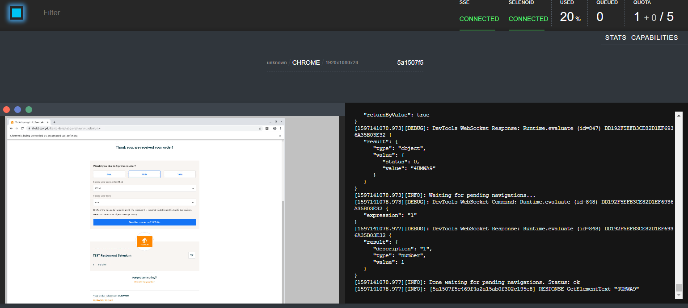
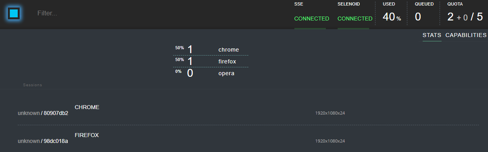
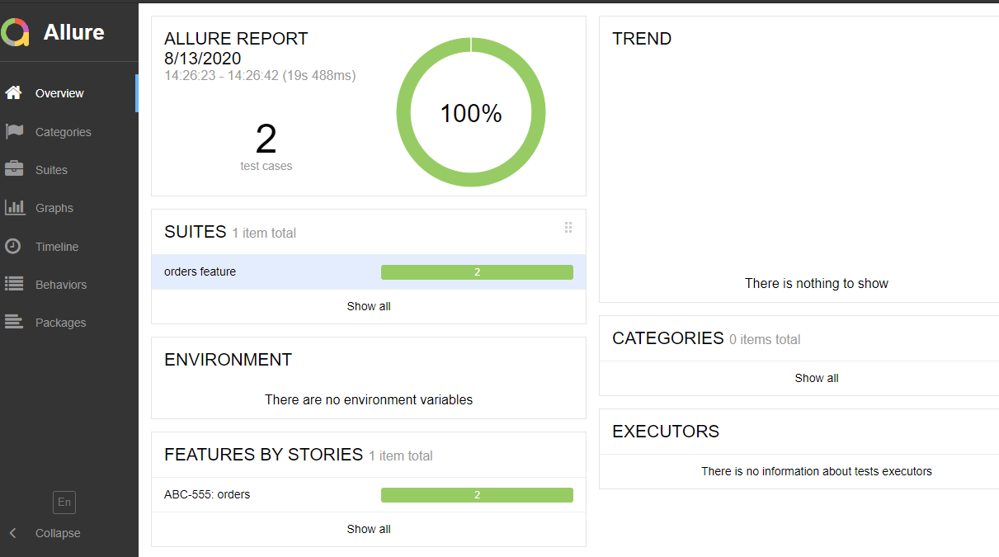
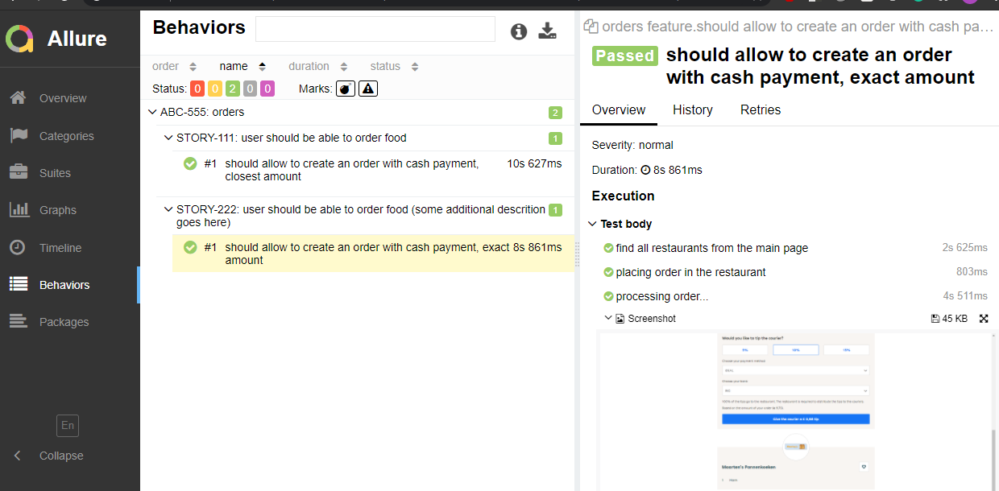
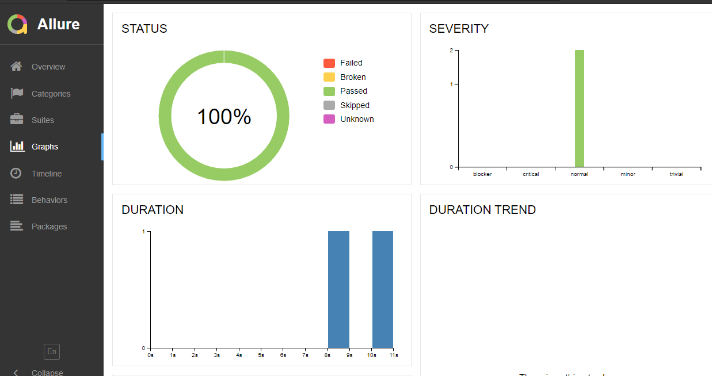

# Takeaway test task

**Table of Contents**
1. [Notes and comments](#notes%20and%20comments)
2. [Todo](#todo)
3. [Preconditions and environment](#preconditions%20and%20environment)
4. [Multiple browsers setup](#multiple%20browsers%20setup)
    1. [How to start selenoid locally](#how%20to%20start%20selenoid%20locally)
5. [Test report](#test%20report)

## Notes and comments
Since I have only 1 day (Sunday) for this task and a few hours each day during the week, I have to choose some
workarounds/quick fixes instead of production-ready solutions, some features are unstable and require more time for investigation.

- **test framework**: protractor@7.0.0. In case I have more time, I would like to try **webdriver.io**.
  cypress/puppeteer - are good for the integration tests, but these 2 cases look more like long and heavy e2e tests
  and should be run with selenium based wrapper.
  codecept.js - I know the author of this framework (Michael Bondarchuk), he also lives in Kyiv. But (at first glance)
  I do not like silly syntax with `I.doSomething`.
    - protractor is installed globally just for this example, usually, it is a part of the test container (with webdriver-manager)
    - **components library** requires time, at least 2-3 weeks to create all fragments/elements: dropdowns, inputs, more complex widget, etc.
      It can be our own solution, or we can use some popular library, e.g. [Page Fragments](https://github.com/Xotabu4/protractor-element-extend)
      as a quick fix I created only high level classes and 1 GenericDropbox as an example, it should be fixed in the future.
    - since it is non-angular site some additional `waitFor` calls required.
    - some selectors should be improved.
    - storing images/screenshot inside git repository is more or less ok for this small example.
- **test structure**. I like classic multi-layers approach, e.g.: DSL methods -> services -> REST/UI classes -> native libraries
  There are a lot of variations, for example with steps-functions (used in allure)
- **"Language of the webpage does not matter (you can use English or Dutch)"** - verified in chrome for both English and Dutch, works ok,
  pages have lots of ids so it is easy to find elements. 
- **reporting**: jasmine supports a lot of reporters, I added only `spec-reporter`, but there is a `custom-reporters` package, etc.
  Visual reporting: very easy choice, since there are no alternatives, [Allure Report](https://docs.qameta.io/allure/#_about)
  is a standard de-facto in the industry.  Results will be generated after each `npm t<:capability>` run, to generate html report run `npm run report`.
  See the screenshot below.
- **"Documentation in code"** - good code should be self-explaining, also I have some comments and TODOs.
  In the real projects I use jsdocs. 
- **"Static data should be read from file"** - I'm not sure that I understand correctly, what data should be read from file...
  - selectors - bad idea, selector should be inside elements/fragments classes.
  - input data - 50/50. sometimes it might be good, e.g. in case of gigantic inputs. But, in general, test data (input data)
    should be as close to test as possible, in this case, it is easy to read and understand the test scenario.
    Anyway, I created data directory, and it can be required in the test, it has orders data, but I didn't use it:)
- **"Coverage of functional scenarios, including corner cases"** - it is the only requirement I didn't understand completely:
  - code coverage (istambul, jacoco, etc.) ? - it should be done during unit tests. I guess [Drill4j](https://github.com/Drill4J) already has UI support.
  - requirements coverage - I do not have any functional requirements for the site. But, it is obvious, that those 2 cases
    do not cover all possible scenarios, negative cases, etc.
    - scenario: the whole scenario(s) is pretty big and should be split into small tests for each page. Case1 and case2 look almost identical.

## Todo
- use [cross-env](https://www.npmjs.com/package/cross-env) module in npm scripts
- add video recording of a tests and subtitles with the custom ffmpeg-reporter
- use `NODE_PATH` variable to avoid relative paths
  
## Preconditions and environment
* install protractor globally
```bash
npm i -g protractor
```
* Test should work on any linux/unix (CentOS, RedHat, Fedora, etc.) and Windows 10 (start from GitBash)
* node.js version v12.18.1 (or higher)
```bash
node -v
v12.18.1
```
* npm version 6.14.5. (package lock will be ignored with npm v less than 5)
```bash
npm -v
6.14.5
```
* webdriver-manager (installed with protractor), run `webdriver-manager update` to get the latest versions of drivers
```bash
npm ls -g webdriver-manager
/usr/local/lib
└─┬ protractor@7.0.0
  └── webdriver-manager@12.1.7

# status after update
webdriver-manager status
[12:02:16] I/status - selenium standalone version available: 3.141.59 [last]
[12:02:16] I/status - chromedriver version available: 84.0.4147.30 [last]
[12:02:16] I/status - geckodriver version available: v0.27.0 [last]
[12:02:16] I/status - IEDriverServer is not present
[12:02:16] I/status - android-sdk is not present
[12:02:16] I/status - appium is not present
```
* Start selenium server
```bash
webdriver-manager start
``` 

## How to run (basic setup with chrome)
* Clone repo
* Install dependencies (`npm i`)
* Run test (`npm t`)
* Open html report (```npm run report```)
```bash
git clone <path to repo>
# ...
cd takeaway-test/
npm i
# ...
npm t
# ...
npm run report
# ...
Report successfully generated to allure-report
Starting web server...
# ...
```



## Multiple browsers setup
The easiest way to run test(s) with multiple/different browser(s) at the same time is to change `capabilities` or
`multiCapabilities` in protractor config and use local browsers (do not forget to run webdriver-manager update before).
I guess I do not want to connect to the local browser (for example I have the only firefox nightly installed and do not want to
download and install a stable version), so the best solution will be to use [Seleniod](https://aerokube.com/selenoid/).
 Steps on how to use selenoid locally are described below.
 
The previous solution is good just to play around, for some local runs, etc. Here are some possible solutions for the
production testing:
  - deploy a cluster of Selenoids in AWS or other cloud providers and manage it ourselves.  
  - if we have more money - [Moon](https://aerokube.com/moon/) can be used.
  - if we have plenty of money and want to waste them all - BrowserStack and other alternatives can be used

**please  note:** tests pass successfully only in chrome, I see that there are some issues with firefox and chrome-headless,
but I need more time to debug and fix them.
 
Here is the list of supported configurations:

`npm t`
```
{
    browserName: 'chrome',
    enableVNC: true,
    version: '',
    platform: 'ANY',
}
```

`npm run test:firefox`

```
{
    browserName: 'firefox',
    enableVNC: true,
    'moz:firefoxOptions': {
        prefs: {
            'geo.enabled': false,
        },
    },
},
```

`npm run test:headless-chrome`

```
{
    browserName: 'chrome',
    chromeOptions: {
        args: ['--headless', '--disable-gpu', '--window-size=1600,1200'],
    },
},
```

`npm run test:multiple`

```
multiCapabilities: [
    {
        browserName: 'chrome',
    },
    {
        browserName: 'firefox',
    },
],
```
### How to start selenoid locally  
- make sure docker is installed and running on your machine.
- download and start `cm` utility, see [official instructions](https://aerokube.com/cm/latest/) or download binary from the
[release page](https://github.com/aerokube/cm/releases). During the first run it will download all necessary browser images.
Run docker images to double check:



You can download additional browser versions if needed.
- start `selenoid-ui`:
```bash
.\cm selenoid-ui start
```
2 containers should run now:



- no need to update test configs, by default tests endpoint is `http://localhost:4444/wd/hub`.
  Check status:
  - `http://localhost:4444/status`
  - docker ps
  - open UI: `http://localhost:8080/`
  
  

- run your tests
    - chrome run
    
    
    - 2 browsers run
    
    

[more details](https://aerokube.com/selenoid/latest/)

## Test report




